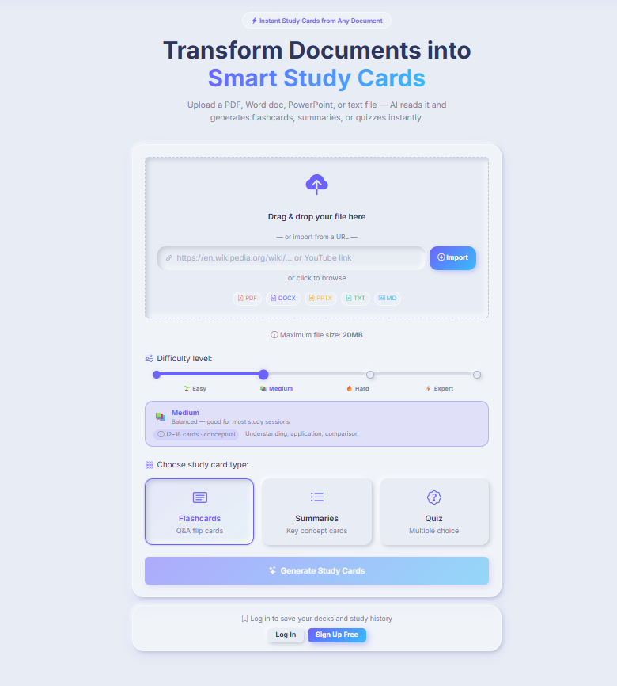
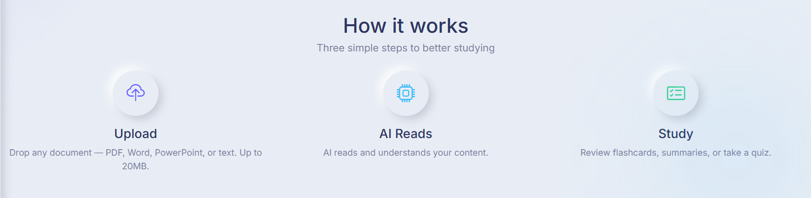
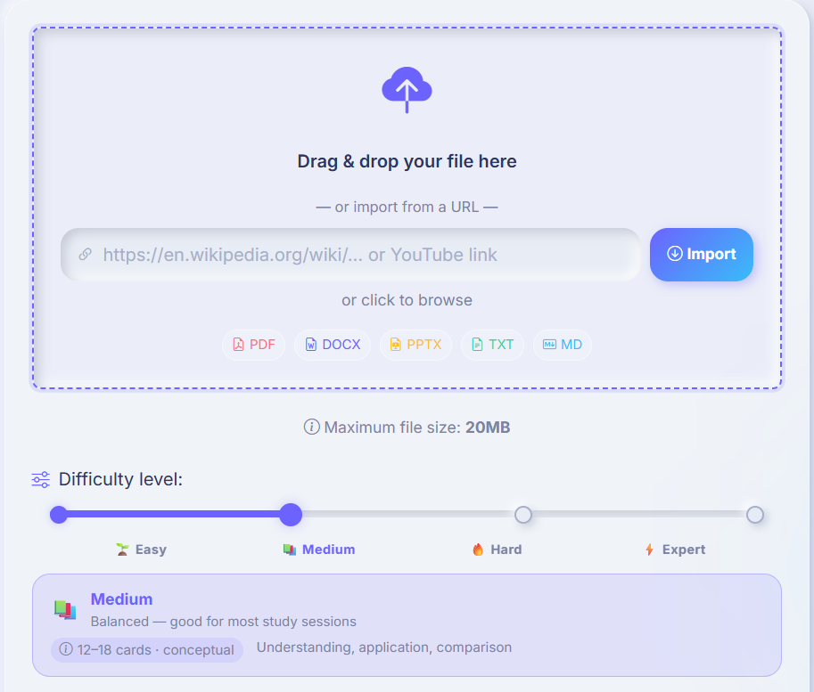
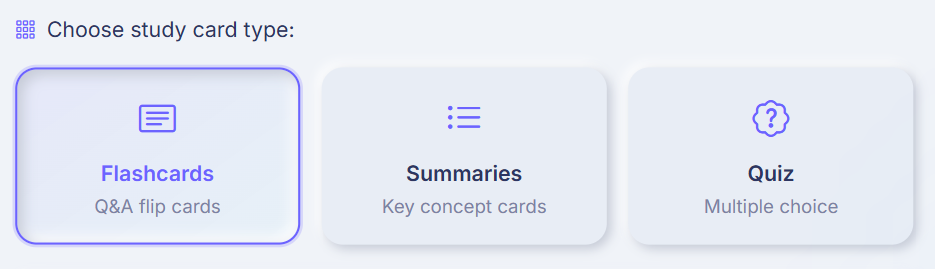
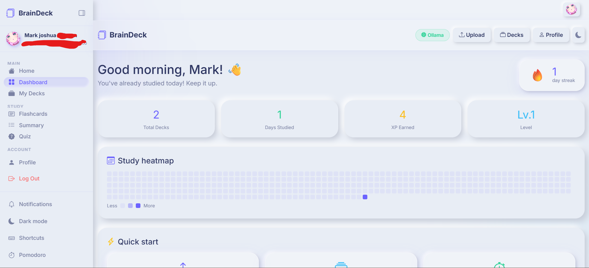

# 🧠 BrainDeck — AI-Powered Document-to-Study-Card App

> **Transform any document into intelligent study materials in seconds**

!

## What is BrainDeck?

**BrainDeck** is a modern, full-featured learning platform that revolutionizes how students, professionals, and lifelong learners study. Upload any document—PDFs, Word files, PowerPoints, web pages, or plain text—and instantly generate personalized flashcards, practice quizzes, and concept summaries using AI.

Unlike passive note-taking apps, BrainDeck combines:
- **Intelligent Content Generation** — AI extracts key concepts and creates study materials automatically
- **Scientific Learning** — Spaced repetition algorithm (SM-2) optimizes retention and recall
- **Gamified Progress** — Daily streaks, XP points, levels, and analytics keep you motivated
- **Study Tools Built-In** — Pomodoro timers, text-to-speech, dark mode, focus mode, and keyboard shortcuts
- **Social Learning** — Share decks with friends via secure links without requiring signup

All powered by your choice of AI: use free **Ollama locally**, or switch between **Claude, OpenAI, Groq, Mistral, Gemini, Together, and more** — no restart needed.

### Who is BrainDeck for?
- 🎓 **Students** — Study for exams faster with AI-generated flashcards
- 📚 **Educators** — Create study materials from lecture slides and textbooks in seconds
- 💼 **Professionals** — Upskill with industry materials and certifications
- 🌍 **Language Learners** — Extract vocabulary and practice from any text or website
- 📖 **Knowledge Workers** — Turn research papers and articles into digestible study cards

---

## Features at a Glance



## Quick Start

**Install dependencies & run locally:**

```bash
npm install
cp .env.example .env   # edit with your settings
npm run dev            # http://localhost:3000
```

> **MySQL via XAMPP** is required for auth and deck features. The core study app (upload + generate) works without it — perfect for testing!

## Getting Started in 3 Steps

### Step 1: Upload Your Content
Drop a PDF, Word doc, PowerPoint, Markdown file, or paste a URL on the home page.



### Step 2: Choose Your Study Format
Select **Flashcards** (interactive flip cards), **Summary** (key concepts), or **Quiz** (multiple choice). Pick your AI provider and Hit generate.



### Step 3: Study Smart
Use spaced repetition, track your streak, share with friends, or export to Anki.



## Database Setup (XAMPP)

1. **Start XAMPP** → start **Apache** and **MySQL**
2. **Open phpMyAdmin** → http://localhost/phpmyadmin
3. Click **Import** → upload `database.sql` from this project folder
4. That's it — all tables are created automatically

Or let Sequelize auto-create them: just start the server and it will create the tables on first run.

**Your `.env` settings (XAMPP defaults):**
```env
DB_HOST=localhost
DB_PORT=3306
DB_NAME=braindeck
DB_USER=root
DB_PASS=
```


---

## Features

### Core
- Upload PDF, DOCX, PPTX, TXT, MD → generate Flashcards, Summaries, or Quiz cards
- 8 AI providers: Ollama (local/free), Claude, OpenAI, Groq, Mistral, Gemini, Together, OpenRouter, Custom
- Switch AI provider live from the navbar — no restart needed

### Authentication & Profiles
- Register / Login / Logout with JWT (15min access + 30d refresh tokens)
- Password reset via email
- Profile page with avatar and name editor
- Saved deck library — all generated decks stored per user

### Study Features
- **Spaced repetition (SM-2)** — cards scheduled by difficulty, tracks ease factor and intervals
- **Streaks & XP** — daily study streak, XP points, level system
- **Study dashboard** — 365-day heatmap, stats, quick-start
- **Focus mode** — fullscreen distraction-free study (F key)
- **Text-to-speech** — reads questions/answers aloud (T key)
- **Pomodoro timer** — floating 25/5 min timer with browser notifications (P key)
- **AI document chat** — floating chat bubble to ask questions about the uploaded doc
- **Dark mode** — full neumorphic dark theme (D key or toggle button)
- **Keyboard shortcuts** — full hotkey support (? to see all)

### Sharing & Export
- **Share deck** — generate a 72h public link anyone can study without an account
- **Export to Anki CSV** — import directly into Anki
- **Export as text** — printable cheat sheet
- **Score share image** — download a PNG of your quiz score to share
- **URL import** — paste any URL on the upload page to generate cards from web content

### Design
- Neumorphism + Glassmorphism design system throughout
- Fully responsive, mobile-first

---

## Pages

| Page | Route | Description |
|------|-------|-------------|
| Upload | `/` | Home, file upload, URL import |
| Flashcards | `/flashcard.html` | Flip card study with SR |
| Summary | `/summary.html` | Key concept cards |
| Quiz | `/quiz.html` | Multiple choice with scoring |
| Dashboard | `/dashboard.html` | Streak, heatmap, stats |
| Decks | `/decks.html` | Saved deck library |
| Profile | `/profile.html` | Account settings |
| Login | `/login.html` | Authentication |
| Register | `/register.html` | Sign up |
| Shared | `/study/:id` | Public shared deck |

---

## Keyboard Shortcuts

| Key | Action |
|-----|--------|
| Space / Enter | Flip card |
| → / L | Next card |
| ← / H | Previous card |
| G | Got it! |
| R | Need review |
| F | Toggle focus mode |
| D | Toggle dark mode |
| T | Toggle text-to-speech |
| P | Pause/resume Pomodoro |
| ? | Show all shortcuts |

---

## API Routes

### Auth
- `POST /api/auth/register` — create account
- `POST /api/auth/login` — login
- `POST /api/auth/logout` — logout
- `POST /api/auth/refresh` — refresh access token
- `POST /api/auth/forgot-password` — send reset email
- `GET  /api/auth/me` — get own profile *(auth)*
- `PATCH /api/auth/me` — update profile *(auth)*

### Decks
- `GET    /api/decks` — list decks *(auth)*
- `POST   /api/decks` — save deck *(auth)*
- `GET    /api/decks/:id` — get deck *(auth)*
- `DELETE /api/decks/:id` — delete deck *(auth)*

### Core
- `POST /api/upload` — upload file
- `POST /api/generate` — generate cards from uploaded file
- `GET  /api/cards/:type` — get cards for type (session switching)

### Features
- `GET  /api/ai-mode` — get current AI mode/provider
- `POST /api/ai-mode` — switch AI provider + key at runtime
- `GET  /api/ollama/models` — list local Ollama models
- `POST /api/chat` — AI document chat
- `POST /api/url-import` — fetch URL and extract text
- `POST /api/share` — create shareable deck link
- `GET  /api/share/:id` — get shared deck
- `GET  /api/health` — health check

---

## Stack

**Frontend** — HTML5, Bootstrap 5, Vanilla JS, Neumorphism + Glassmorphism CSS
- Progressive Web App (PWA) — works fully offline
- Responsive mobile-first design
- Keyboard shortcuts for power users
- Dark mode & accessibility features

**Backend** — Node.js, Express.js, Sequelize ORM
- RESTful API with rate limiting
- JWT authentication (15min access + 30d refresh tokens)
- Session-based uploads and temporary storage
- Email verification & password reset flows

**Database** — MySQL (via Sequelize)
- User accounts & authentication
- Deck library & card metadata
- Study progress & spaced repetition data
- Sharing tokens & public deck links

**AI Integration** — Universal API layer
- **Local**: Ollama (free, privacy-focused)
- **Cloud**: Claude, OpenAI, Groq, Mistral, Gemini, Together, OpenRouter
- Runtime switching without restart
- Custom provider support

**Content Extraction** — Multi-format support
- PDFs (pdf-parse)
- Word documents (mammoth)
- PowerPoint (adm-zip)
- OCR extraction (tesseract.js)
- Web scraping (axios)

**Security Features**
- bcrypt password hashing
- CORS configured for safety
- Helmet middleware for XSS/clickjack protection
- Rate limiting on sensitive endpoints
- Secure file upload validation

## Architecture Overview

```
BrainDeck
├── Frontend (Public SPA)
│   ├── Upload page (file/URL input)
│   ├── Study modes (flashcard, summary, quiz)
│   ├── Dashboard (progress, streaks, heatmap)
│   └── Sharing (public deck browsing)
│
├── Backend API (Node.js + Express)
│   ├── Auth routes (register/login/reset)
│   ├── Deck management
│   ├── AI generation engine
│   └── Sharing & export handlers
│
└── Database (MySQL)
    ├── Users & profiles
    ├── Decks & cards
    ├── Study sessions & progress
    └── Sharing metadata
```

## Advanced Features Explained

### 🎯 Spaced Repetition (SM-2 Algorithm)
Cards are intelligently scheduled based on:
- **Difficulty rating** — How well you knew the card (1-5 scale)
- **Ease Factor** — Adjusted based on performance history
- **Review Intervals** — Optimally timed for long-term retention

Cards you struggle with appear more frequently; cards you know well are scheduled weeks or months out.

### 🔥 Streaks & Gamification
- Daily streak counter keeps momentum
- XP points awarded for each study session
- Level system unlocks as you progress
- 365-day heatmap shows your study patterns (à la GitHub)

### 🤖 AI Document Chat
While studying, ask questions about the original document using the floating chat bubble. The AI references your uploaded content for accurate answers.

### 📤 Sharing & Export
- **Public Links** — Generate a shareable 72-hour link. Anyone can study without creating an account
- **Anki Export** — Export as CSV for use in Anki (popular SRS tool)
- **Text Export** — Printable cheat sheet format
- **Score Sharing** — Download quiz results as an image for social media

### 🎨 Design System
- **Neumorphism** — Soft, modern UI aesthetic
- **Glassmorphism** — Frosted glass effects
- **Dark Mode** — Full theme support with smooth transitions
- **Mobile-First** — Optimized for phones, tablets, desktops

---

## API Routes

### Auth
- `POST /api/auth/register` — create account
- `POST /api/auth/login` — login
- `POST /api/auth/logout` — logout
- `POST /api/auth/refresh` — refresh access token
- `POST /api/auth/forgot-password` — send reset email
- `GET  /api/auth/me` — get own profile *(auth)*
- `PATCH /api/auth/me` — update profile *(auth)*

### Decks
- `GET    /api/decks` — list decks *(auth)*
- `POST   /api/decks` — save deck *(auth)*
- `GET    /api/decks/:id` — get deck *(auth)*
- `DELETE /api/decks/:id` — delete deck *(auth)*

### Core
- `POST /api/upload` — upload file
- `POST /api/generate` — generate cards from uploaded file
- `GET  /api/cards/:type` — get cards for type (session switching)

### Features
- `GET  /api/ai-mode` — get current AI mode/provider
- `POST /api/ai-mode` — switch AI provider + key at runtime
- `GET  /api/ollama/models` — list local Ollama models
- `POST /api/chat` — AI document chat
- `POST /api/url-import` — fetch URL and extract text
- `POST /api/share` — create shareable deck link
- `GET  /api/share/:id` — get shared deck
- `GET  /api/health` — health check

---

---

## Environment Variables

Copy `.env.example` to `.env`:

```env
NODE_ENV=development
PORT=3000
MONGO_URI=mongodb://localhost:27017/braindeck
JWT_SECRET=your-secret-here
AI_MODE=Local                    # local or cloud
OLLAMA_URL=http://localhost:11434
CLAUDE_API_KEY=                  # optional — set in UI instead
```

---

## Contributing

Pull requests welcome! Areas for contribution:
- [ ] Mobile app (React Native)
- [ ] Additional AI provider integrations
- [ ] More OCR languages
- [ ] Dark mode improvements
- [ ] Test coverage expansion

## License

MIT — Feel free to fork and deploy!

## Support

Found a bug? Have a feature idea?
- Open an [Issue](https://github.com/YOUR_USERNAME/BrainDeck/issues)
- Check [ISSUES_AND_FIXES.md](ISSUES_AND_FIXES.md) for known issues

---

## Roadmap

**Planned Features**:
- 🎵 Audio file support (transcribe + generate from podcasts)
- 🌐 Multi-language UI
- 📊 Advanced analytics & study insights
- 👥 Study groups & collaborative learning
- 🏆 Leaderboards & challenges
- 🔗 Integration with popular learning platforms

---

## Acknowledgments

Built with ❤️ for learners everywhere. Special thanks to:
- The Ollama team for free local AI
- The spaced repetition community (SM-2 algorithm)
- Bootstrap & open-source contributors

---

**Start learning smarter today** — Upload a document and see the magic happen! ✨
